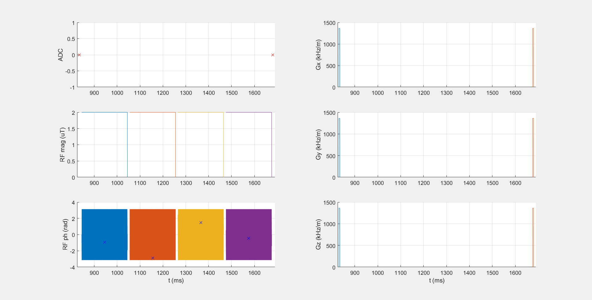
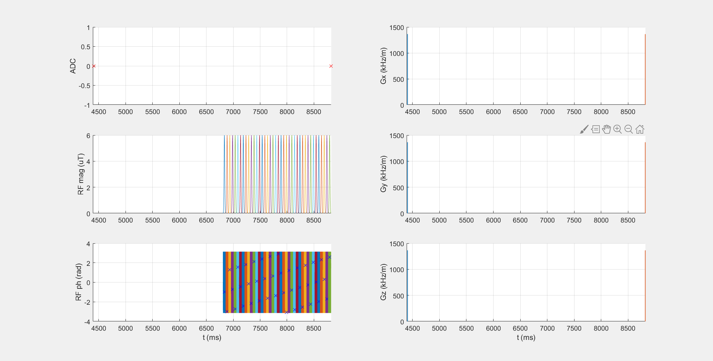
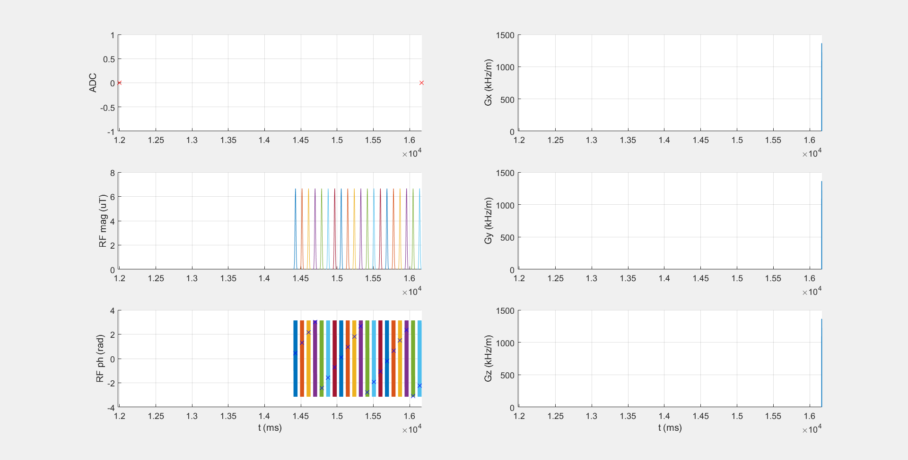
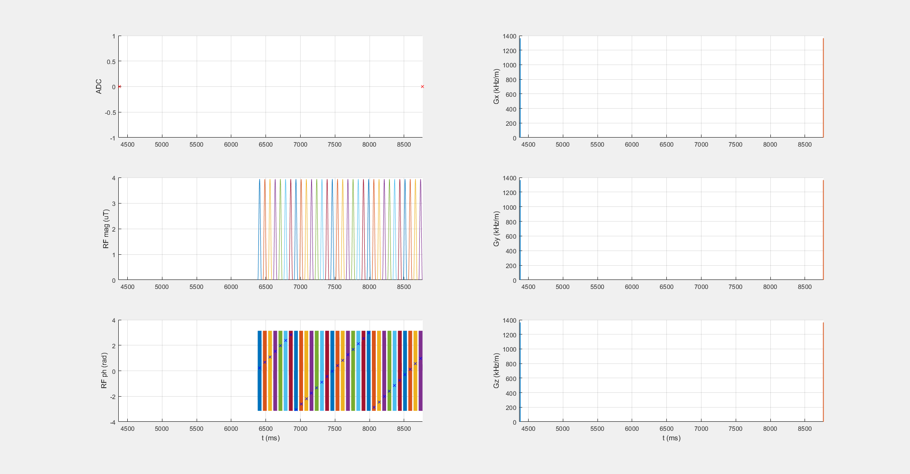
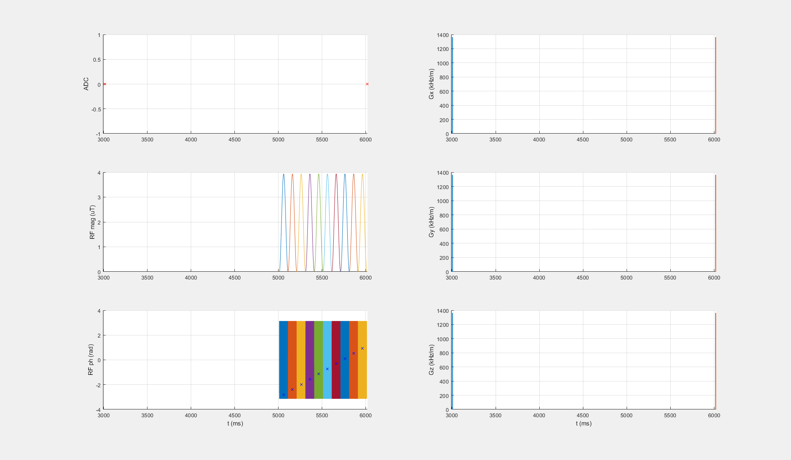
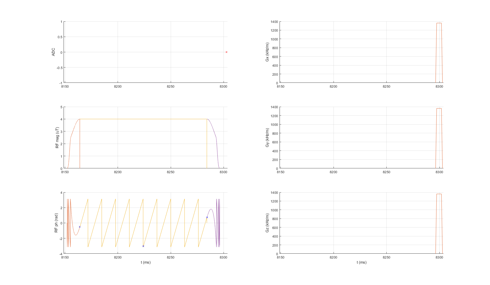

# pulseq-cest

Welcome to the **pulseq-cest** repository. Here, published and approved CEST saturation blocks are made available in the open pulseq standard (https://pulseq.github.io/).
This allows exact comparison of CEST saturation blocks with newly developed or adapted saturation blocks. This enables reproducible CEST research.
Below you find a list of already defined CEST presaturation schemes as .seq files, together with the corresponding  Matlab generation file.
All .seq files can be loaded in Matlab for plotting and detailed inspection, but also for simulation via the built-in Bloch-McConnell simulation in [pulseq-cest-sim](pulseq-cest-sim).

## Quick start
To view pulseq files in Matlab, download the whole repository, add it to your Matlab path, and run the file **plot_seq_file.m**.
You can simulate the .seq file by running [pulseq-cest-sim/Run_pulseq_cest_Simulation.m](pulseq-cest-sim/Run_pulseq_cest_Simulation.m). 

| SAT identifier with .seq file   and .m file                                                                                                     |            scheme  (seq.plot)                                          |  Description              |  Publication                                                                  | Approved by Authors|
|------------------                                                                                                                               |:-------------------:                                                   |-------------:             |--------------                                                                 |--------------------|
| [APTw_3T_001_Zhou2019.seq](cest-seq-library/APTw_3T_001_Zhou2019.seq), [APTw_3T_001_Zhou2019.m](cest-seq-library/APTw_3T_001_Zhou2019.m)     |      | APTw, 2µT, 0.8s, DC95     | [Zhou et al 2019](https://onlinelibrary.wiley.com/doi/full/10.1002/jmri.26645)| **not approved!**
| [APTw_3T_002_Keupp2011.seq](cest-seq-library/APTw_3T_002_Keupp2011.seq), [APTw_3T_002_Keupp2011.m](cest-seq-library/APTw_3T_002_Keupp2011.m) |     | APTw, 2µT, 2s, DC100      | [Togao et al 2016](https://doi.org/10.1371/journal.pone.0155925) | **not approved!** |
| [APTw_3T_003_GLINT.seq](cest-seq-library/APTw_3T_003_GLINT.seq), [APTw_3T_003_GLINT.m](cest-seq-library/APTw_3T_003_GLINT.m)                 |         | APTw, 2.22µT, 1.8s, DC50  | [cest-sources (APTw_1)](https://cest-sources.org/doku.php?id=standard_cest_protocols) | approved |
| [DGE_7T_001_Xu2019.seq](cest-seq-library/DGE_7T_001_Xu2019.seq), [DGE_7T_001_Xu2019.m](cest-seq-library/DGE_7T_001_Xu2019.m)                 |         | APTw, 2µT, 0.8s, DC50     | [Zaiss et al 2006](doi:...)| **not approved!** |
| [Glut_7T_001_Cai2003.seq](cest-seq-library/Glut_7T_001_Cai2003.seq), [Glut_7T_001_Cai2003.m](cest-seq-library/Glut_7T_001_Cai2003.m)         |       | APTw, 2µT, 0.8s, DC50     | [Zaiss et al 2006](doi:...)| **not approved!** |
| [DGErho_3T_001_Herz2019.seq](cest-seq-library/DGErho_3T_001_Herz2019.seq), [DGErho_3T_001_Herz2019.m](cest-seq-library/DGErho_3T_001_Herz2019.m)         |       | SLExp, 4µT, 0.12s    | [Herz et al 2019](https://doi.org/10.1002/mrm.27857)| approved |
