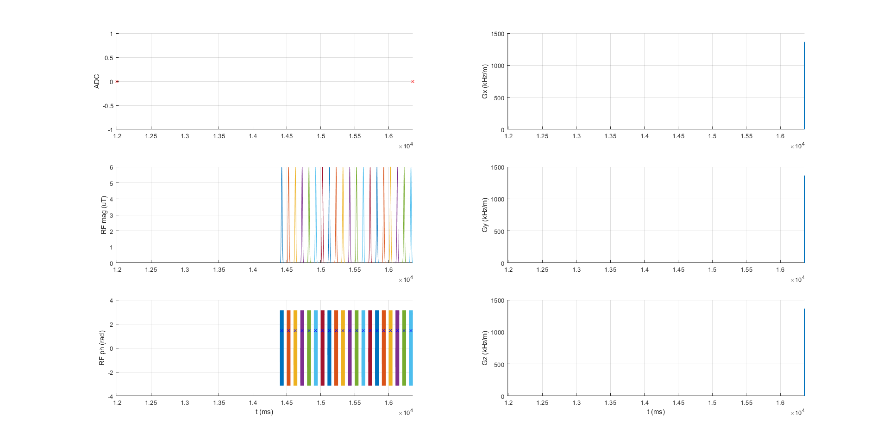
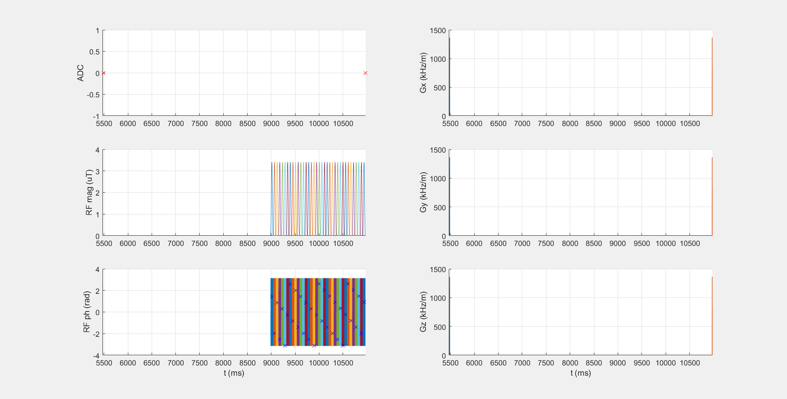

| SAT identifier with .seq file   and .m file                                                                   |            scheme  (seq.plot)                         |  Description              |  Publication                                                                  | Approved by Authors|
|------------------                                                                                             |:-------------------:                                  |-------------:             |--------------                                                                 |--------------------|
| [APTw_3T_001_Zhou2019.seq](APTw_3T_001_Zhou2019.seq), [APTw_3T_001_Zhou2019.m](APTw_3T_001_Zhou2019.m)     |      | APTw, 2µT, 0.8s, DC95     | [Zhou et al 2019](https://onlinelibrary.wiley.com/doi/full/10.1002/jmri.26645)| **not approved!**
| [APTw_3T_002_Keupp2011.seq](APTw_3T_002_Keupp2011.seq), [APTw_3T_002_Keupp2011.m](APTw_3T_002_Keupp2011.m) |     | APTw, 2µT, 2s, DC100      | [Togao et al 2016](https://doi.org/10.1371/journal.pone.0155925) | **not approved!** |
| [APTw_3T_003_GLINT.seq](APTw_3T_003_GLINT.seq), [APTw_3T_003_GLINT.m](APTw_3T_003_GLINT.m)                 |         | APTw, 2.22µT, 1.8s, DC50  | [cest-sources (APTw_1)](https://cest-sources.org/doku.php?id=standard_cest_protocols) | approved |
| [DGE_7T_001_Xu2019.seq](DGE_7T_001_Xu2019.seq), [DGE_7T_001_Xu2019.m](DGE_7T_001_Xu2019.m)                 |         | APTw, 2µT, 0.8s, DC50     | [Xu et al 2019](doi:...)| **not approved!** |
| [Glut_7T_001_Cai2003.seq](Glut_7T_001_Cai2003.seq), [Glut_7T_001_Cai2003.m](Glut_7T_001_Cai2003.m)         |       | APTw, 2µT, 0.8s, DC50     | [Cai et al 2006](doi:...)| **not approved!** |
| [DGErho_3T_001_Herz2019.seq](DGErho_3T_001_Herz2019.seq), [DGErho_3T_001_Herz2019.m](DGErho_3T_001_Herz2019.m)         |       | SLExp, 4µT, 0.12s    | [Herz et al 2019](https://doi.org/10.1002/mrm.27857)| approved |
| [APTw_3T_800ms.seq](APTw_3T_800ms.seq),  [APTw_3T_800ms.m](APTw_3T_800ms.m)  |   | APTw, 2µT, 0.8s    | | |
  [APTw_3T_DC50.seq] (APTw_3T_DC50.seq),   [APTw_3T_DC50.m](APTw_3T_DC50.m)    |    | APTw, 2µT, 2.0s    | | |
  [APTw_3T_DC90.seq] (APTw_3T_DC90.seq),   [APTw_3T_DC90.m](APTw_3T_DC90.m)    |    | APTw, 2µT, 2.2s    | | |
