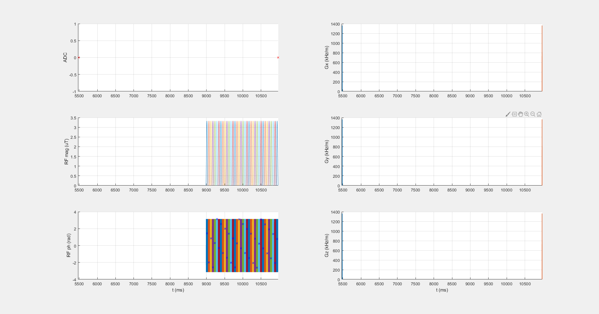
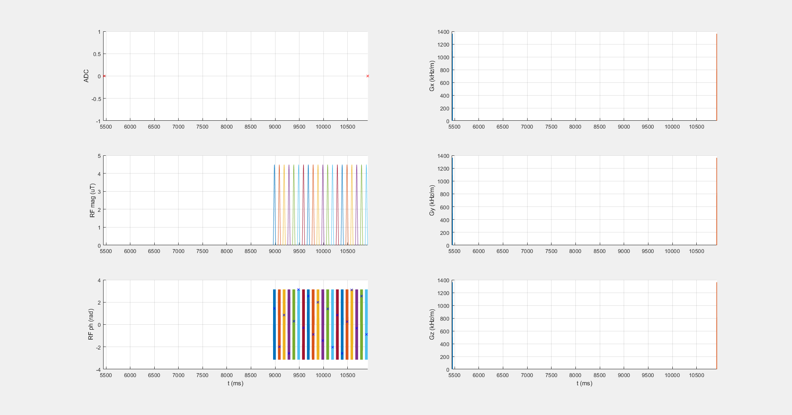
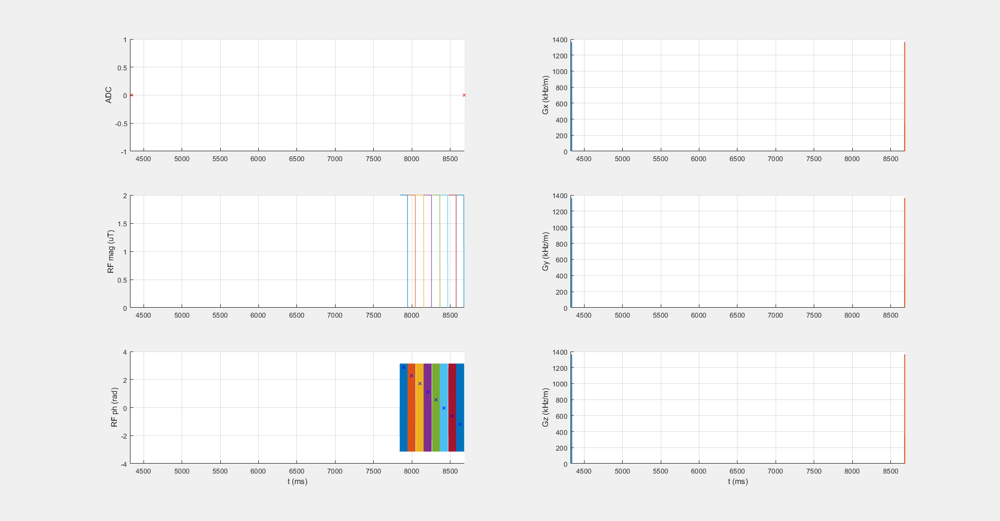
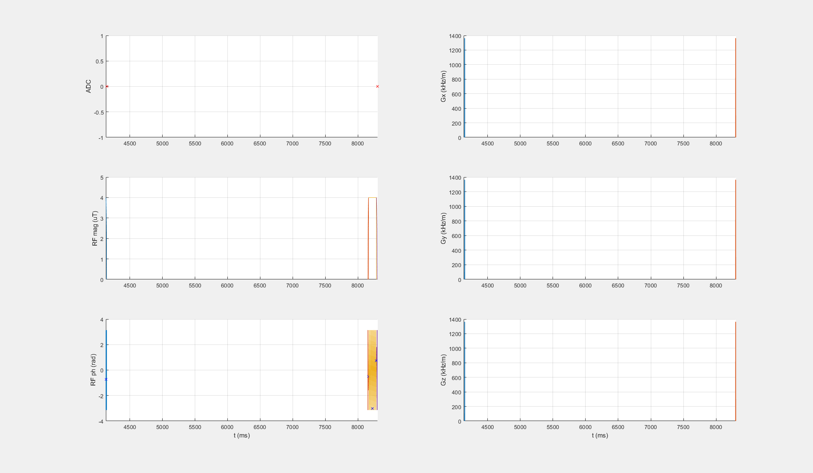

| SAT identifier with .seq file   and .m file                                                                   |            scheme  (seq.plot)                         |  Description              |  Publication                                                                  | Approved by Authors|
|------------------                                                                                             |:-------------------:                                  |-------------:             |--------------                                                                 |--------------------|
| [APTw_3T_001_2uT_36SincGauss_DC90_2s_braintumor.seq](APTw_3T_001_2uT_36SincGauss_DC90_2s_braintumor.seq), [APTw_3T_001_2uT_36SincGauss_DC90_2s_braintumor.m](APTw_3T_001_2uT_36SincGauss_DC90_2s_braintumor.m)     |      | APTw, B1cwpe = 2 µT, Tsat = 1.975 s, DCsat = 90     | | 
| [APTw_3T_002_2uT_20SincGauss_DC50_2s_braintumor.seq](APTw_3T_002_2uT_20SincGauss_DC50_2s_braintumor.seq), [APTw_3T_002_2uT_20SincGauss_DC50_2s_braintumor.m](APTw_3T_002_2uT_20SincGauss_DC50_2s_braintumor.m) |     | APTw, B1cwpe = 2 µT, Tsat = 1.95 s, DCsat = 50       |  | |
| [APTw_3T_003_2uT_8block_DC95_834ms_braintumor.seq](APTw_3T_003_2uT_8block_DC95_834ms_braintumor.seq), [APTw_3T_003_2uT_8block_DC95_834ms_braintumor.m](APTw_3T_003_2uT_8block_DC95_834ms_braintumor.m)                 |         | APTw, B1cwpe = 2 µT, Tsat = 0.834 s, DCsat = 95   | | |
| [DGErho_3T_001_4uT_adiaSL_DC100_120ms_braintumor.seq](DGErho_3T_001_4uT_adiaSL_DC100_120ms_braintumor.seq), [DGErho_3T_001_4uT_adiaSL_DC100_120ms_braintumor.m](DGErho_3T_001_4uT_adiaSL_DC100_120ms_braintumor.m)         |       | SLExp, APTw, B1cwpe = 2 µT, Tsat = 0.12 s    | [Herz et al 2019](https://doi.org/10.1002/mrm.27857)| approved |

