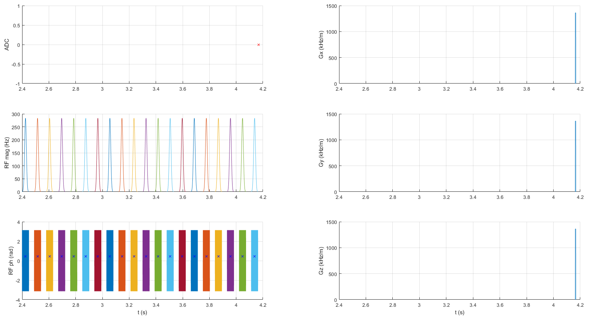

# Getting started
Have a look at the saturation events by running:
```Matlab
>> plot_seq_file
```
and choose the [example_APTw.seq](example_APTw.seq) file. 
You should see something similar as this:



If you want to run the Bloch-McConnell simulation for that Z-spectrum experiment with a standard setting for 3 T, just run
```Matlab
>> Simulate_example
```

The simulation runs the BlochMcConnell simulation of the [.seq-file](example_APTw.seq) for the simulation setting defined in the [.sim-file](example_cest_sim_params.sim). You should see a plot of the Z-spectrum and the MTR<sub>asym</sub> curve.

## .yaml parameter files
Simulation parameter definitions in yaml files allows to share settings without the need to adapt any code. The files can be viewed and edited with a simple text editor. All parameters for the simulation are quickly described here:

### Water Pool (mandatory)  
```
water_pool: {
  f: 1,
  r1: 1 / 1.3,
  r2: 1 / 75e-3
}
```
* f: proton fraction (relative) (float)
* r1: inverse relaxation time R1 = 1/T1 [Hz] (float)
* r2 inverse relaxation time R2 = 1/T2 [Hz] (float)

### CEST pool(s) (optional)
An arbitrary number of pools ca be set here, by just adding new pools in the *cest_pool* dict. 
```
cest_pool: {
  'Amide': {
    f: 72e-3/111,
    r1: 1 / 1.3,
    r2: 1/100e-3,
    k: 30,
    dw: 3.5
  },
  'Creatine': {
    f: 20e-3/111,
    r1: 1 / 1.3,
    r2: 1/100e-3,
    k: 1100,
    dw: 2
  }
}
```
* dw: chemical shift from water [ppm] (float)
* k: exchange rate [Hz] (float)

### MT Pool (optional)

A semi-solid MT pool with either a Lorentzian or a SuperLorentzian lineshape can be set as well. 

```
mt_pool: {
  f: 0.05,
  r1: 1 / 1.3,
  r2: 1e5,
  k: 23,
  dw: -2,
  lineshape: 'SuperLorentzian'
}
```
* lineshape: string with MT lineshape. Either *Lorentzian* or *SuperLorentzian*


### Field properties 
*b0* and *gamma* are mandatory.
```
b0: 3
gamma: 267.5153
b0_inhom: 0.0
rel_b1: 1
```
* b0: field strength [T] (float)
* gamma: gyromagnetic ratio [rad / uT], default is 267.5153 (float)
* b0_inhom: field inhomogeneity [ppm], default is 0.0 (float)
* rel_b1: relative b1 inhomogeneity, default is 1.0 (float)


### additional optional parameters

```
scale: 0.5
```
* scale: relative Magnetization after recovery between 0 and 1, default is 1 (float)

```
verbose: 0.5
```
* verbose: true, you want some output info from the mex-funtion. Default is false

```
reset_init_mag: true
```
* reset_init_mag: True if magnetization should be reset after each ADC, default is True (bool)

```
max_pulse_samples: 200
```
* max_pulse_samples: sets the number of samples for the shaped pulses, default is 500 (int)

