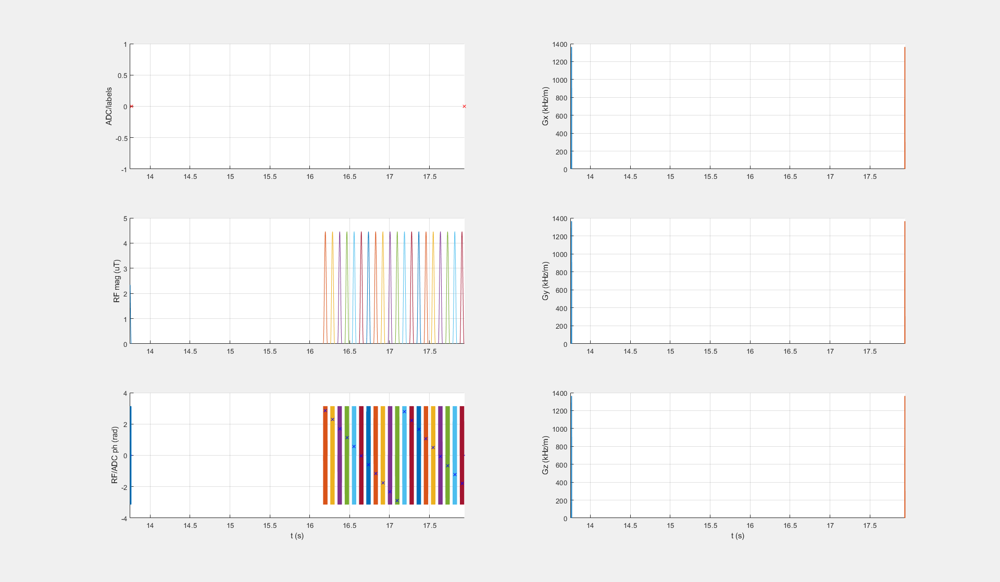

# Getting started
Have a look at the saturation events by running:
```Matlab
>> seq = SequenceSBB;
>> seq.read('APTw_3T_example.seq');
>> seq.plotSaturationPhase();
```

These commands load the .seq-file containing all preparation events and plots a single preparation period (from the first to the second ADC event).

You should see something similar to this:



If you want to run the Bloch-McConnell simulation for that Z-spectrum experiment with a example setting for 3 T, just run
```Matlab
>> simulateExample
```

This simulates the [.seq-file](APTw_3T_example.seq) sequence for the simulation setting defined in the [.yaml-file](GM_3T_example_bmsim.yaml). You should see a plot of the Z-spectrum and the MTR<sub>asym</sub> curve.

## pulseq-files

This example APT-weighted protocol [file](APTw_3T_example.seq) was generated using the [writeExampleAPTwSeqFile](../seq-generation/writeExampleAPTwSeqFile.m) function. Feel free to play around with various parameters to generate different preparation periods for your own purpose. You can find more info in the subfolder [Readme](../seq-generation/Readme.md).


## yaml parameter files
Simulation parameter definitions in yaml files allows to share settings without the need to adapt any code. The files can be viewed and edited with a simple text editor. All parameters for the simulation are quickly described here:

### Water Pool (mandatory)  
```
water_pool: {
  f:  1,
  t1: 1.3,
  t2: 75.0e-3
}
```
* f: proton fraction (relative) (float)
* t1: T1 [s] (float)
* t2: T2 [s] (float)

### CEST pool(s) (optional)
An arbitrary number of pools ca be set here, by just adding new pools in the *cest_pool* dict. 
```
cest_pool: {
  'Amide': {
    f: 6.4865e-04,
    t1: 1.3,
    t2: 100.0e-3,
    k: 30,
    dw: 3.5
  },
  'Creatine': {
    f: 1.8018e-04,
    t1: 1.3,
    t2: 100.0e-3,
    k: 1100,
    dw: 2
  }
}
```
* dw: chemical shift from water [ppm] (float)
* k: exchange rate [Hz] (float)

### MT Pool (optional)

A semi-solid MT pool with either a Lorentzian or a SuperLorentzian lineshape can be set as well. 

```
mt_pool: {
  f: 0.05,
  t1: 1.3,
  t2: 1.0e-5,
  k: 23,
  dw: 0,
  lineshape: 'SuperLorentzian'
}
```
* lineshape: string with MT lineshape. Either *Lorentzian* or *SuperLorentzian*


### Field properties 
*b0* and *gamma* are mandatory.
```
b0: 3
gamma: 267.5153
b0_inhom: 0.0
rel_b1: 1
```
* b0: field strength [T] (float)
* gamma: gyromagnetic ratio [rad / uT], default is 267.5153 (float)
* b0_inhom: field inhomogeneity [ppm], default is 0.0 (float)
* rel_b1: relative b1 inhomogeneity, default is 1.0 (float)


### additional optional parameters

```
scale: 0.5
```
* scale: relative Magnetization after recovery between 0 and 1, default is 1 (float)
This is neccessary as the readout is not simulated, just the preparation period. This means that the magnetization vector after the readout marks the initial magnetization vector for the simulation. For an EPI with a 90 degree flip angle, there would be almost no longitudinal magnetization, i.e. scale = 0.0. For a flash sequence it would be 1/(2 - T<sub>R</sub>/T<sub>1</sub>).

```
verbose: false
```
* verbose: true, you want some output info from the mex-funtion. Default is false

```
reset_init_mag: true
```
* reset_init_mag: True if magnetization should be reset to the initial value after each ADC, default is True (bool)
As eleborated for the *scale* parameter, the readout sequence is usually not simulated and the initial magnetization vector is the same after each ADC. However, some applications require the evolution of the transient magnetization and therefore also inlude a basic readout simulation. For this purpose, *reset_init_mag* can be set to false, in which case one magnetization vector is used for the entire simulation and there is no reset after an ADC. 

```
max_pulse_samples: 200
```
* max_pulse_samples: sets the number of samples for the shaped pulses, default is 100 (int)
The simulation detects the shape of the saturation pulse and chooses the minimum required samples automatically. For instance, a block pulse can be simulated with just a single sample, which saves a lot of time. Shaped pulses with more samples than max_pulse_samples are resampled to that number.

## Multiple Z-spectra for intravoxel dephasing
CEST simulations are usually performed for a single isochromat, i.e. a set of spins resonating at the same resonance frequency. However, in a real system, a sample experiences dephasing due to isochromats resonating at different Larmor frequencies (T<sub>2</sub>*) and therefore multiple isochromats are needed to describe the system more accurate. As CEST preparation pulses are spatially non-selective, the same location for all isochromats can be used. The use of multiple isochromats can be enabled by setting the corresponding parameters in the .yaml-file. There is an example included in [GM_3T_multi_isochromats_example_bmsim.yaml](GM_3T_multi_isochromats_example_bmsim.yaml). 

The different isochromats are simulated as shifted Z-spectra, where the offset frequency follows a Cauchy-Lorentz distribution according to [Stöcker et al.](https://doi.org/10.1002/mrm.22406):

Δω(r) = R<sub>2</sub>' tan(0.9*π(X(r)-0.5))

The example uses 32 isochromats and a T<sub>2</sub>* of 65 ms. All isocromats are simulated as an entire Z-spectrum, where parallelization is employed via the [Parallel Computing Toolbox](https://de.mathworks.com/help/parallel-computing/spmd.html) of MATLAB.
```
### water pool
water_pool: {
  f: 1,
  t1: 1.3,
  t2: 75.0e-3,
  # optional parameters for multiple isochromat simulation
  # if these are set, a total amount of isochromats is simulates with a b0 shift following:
  # \delta\omega(r) = 1/t2dash * tan(.9*pi(X(r)-.5))
  # with 1/t2dash = 1/t2star-1/t2
  # see doi:10.1002/mrm.22406 or supporting info of https://doi.org/10.1002/mrm.28825 
  t2star: 65.0e-3,
  isochromats: 32
}
```
